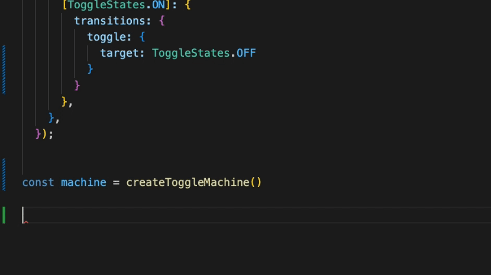
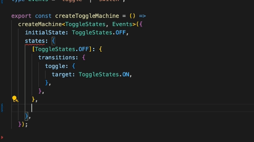

# Finite State Machine

## Table of Contents

1. [Intro](#intro)

2. [Key Features](#key-features)

   - [TypeScript](#typescript)
   - [useSyncExternalState vs Context API](#usesyncexternalstate-vs-context-api)
   - [Machines](#machines)
   - [RTK query - Optimistic UI](#rtk-query---optimistic-ui)

3. [Future Improvements](#future-improvements)

4. [Setup & Scripts](#setup--scripts)

   - [Setup](#setup)
   - [Scripts](#scripts)

## Intro

Contact Book App is a straightforward contact list application with all the CRUD operations—adding, editing, and deleting contacts. It’s built using a Finite State Machine, React, Redux Toolkit, and TypeScript and more. I aimed to showcase the concept of finite state machines in several ways, drawing inspiration from Machina-js, an article by Kent C. Dodds, XState, React, and Redux.

In this app, you’ll find a basic implementation of a finite state machine, with TypeScript helping to infer possible states and transitions.

## Key Features

### TypeScript

I opted for TypeScript to enhance type safety and clarity in defining state structures and transitions. This ensures that only valid states and transitions are allowed.

Here are some visual examples:




### useSyncExternalState vs Context API

First, the `Context API` isn't designed to be a state management solution. it's mainly about injection, or a way to pass data through the component tree without manually passing props down at every level.

However, we can use the `Context API` to pass the state object down. Whenever the parent component re-renders and provides a new reference to the context provider as the value, any component that reads from that context will be forced to re-render. This might seem beneficial at first glance.

From React's perspective, each context provider only has a single value—whether it's an object, array, or primitive, it's just one context value. Currently, there is no way for a component that consumes a context to skip updates caused by new context values, even if it only cares about part of a new value.

For instance, if a component only needs `value.a` and an update causes a new `value.b` reference, the rules of immutable updates and context rendering require that the entire value be a new reference. Consequently, the component reading `value.a` will also re-render.

Another issue is that React has to trace through the component tree to find all the matching context consumers. In a simple app structure, React would essentially do this automatically because calling `setState()` in the root component would recursively cause the entire component tree to re-render.

Here is more information about why I chose `useSyncExternalStore` over the `Context API`:

1. **Mark Erikson, Redux maintainer, explains why direct subscriptions were reintroduced in React-Redux v7**: ["...which is why we had to rewrite the internal implementation to use direct subscriptions again in React-Redux v7..."](https://github.com/reduxjs/react-redux/issues/1177).

2. **Discussion in the React working group about `useSyncExternalStore`**: [React working group discussion](https://github.com/reactwg/react-18/discussions/86#discussioncomment-1281745).

3. **Introduction of `useSyncExternalStore` by the React working group**: [React working group introduces `useSyncExternalStore`](https://github.com/reactwg/react-18/discussions/86).

4. **How `xState` uses `useSyncExternalStore` to subscribe to state changes**: [xState `useSyncExternalStore` implementation](https://github.com/statelyai/xstate/blob/main/packages/xstate-react/src/useActor.ts#L37).

5. **How `React-Redux` uses `useSyncExternalStore` to subscribe to state changes**: [React-Redux `useSyncExternalStore` implementation](https://github.com/reduxjs/react-redux/blob/master/src/hooks/useSelector.ts#L249).

6. **React `useSyncExternalStore` documentation**: [React `useSyncExternalStore` docs](https://react.dev/reference/react/useSyncExternalStore).

7. **In-depth guide to React rendering behavior by Mark Erikson**: [A Mostly Complete Guide to React Rendering Behavior](https://blog.isquaredsoftware.com/2020/05/blogged-answers-a-mostly-complete-guide-to-react-rendering-behavior/).

8. **Differences between Context and Redux by Mark Erikson**: [Context vs. Redux](https://blog.isquaredsoftware.com/2021/01/context-redux-differences/).

Finally, I opted to use `useSyncExternalStore` instead of the `Context API`. This choice allows for subscribing to specific state changes and re-rendering only the necessary components.

`React-Redux` still uses the `Context API` to pass the state object down, but it doesn't subscribe to changes via the `Context API`. `xState`, on the other hand, doesn't use the `Context API` because there could be multiple state machines. Instead, with `xState`, you pass the machine directly to the hook to subscribe to changes.

I adopted `xState's` approach and modified it for my simple implementation, allowing each machine to have its own state and subscribe to it. The `useSyncExternalStore` ensures that only the necessary components are re-rendered.

```ts
const machineState = useMachineSelector(machine)
const transition = useMachineTransition(machine)
transition('toggle')
```

> Certainly, TypeScript support enables the automatic inference of types for both event names and state values, enhancing development efficiency and reliability.

### Machines

I developed several machines simply to showcase the concept of finite state.

1. `connectivity.machine.ts` - Demonstrates a simple machine that handles states and the ussage of onEnter hook. in this example I used it to store the state in localStorage.

2. `getContacts.machine.ts` - Demonstrates a complex machine that handles states and transitions.

3. `theme.machine.ts` - Demonstrates a simple machine that handles Dark/Light Mode.

4. `toggle.machine.ts` - Demonstrates a reusable machine that handles toggling states.

> For instance, handling Dark/Light Mode could be implemented as a toggle machine. However, I opted to create it as a simple machine to better illustrate the concept of a basic state machine.

### RTK query - Optimistic UI

I added Redux Toolkit to manage the application state and handle all asynchronous data fetching.

Some key aspects to highlight:

1. For the `addContact` functionality, I implemented the optimistic UI pattern to update the interface before receiving the server response.
2. To handle the `getContacts` operation, I developed a custom hook specifically to integrate with the simple state machine and manage the request state. (Of course, this functionality could be obtained effortlessly using RTK Query.)
3. In contrast, for the `updateContact` feature, I deliberately refrained from using the optimistic UI pattern to emphasize the distinction between the two approaches.

## Future Improvements

If I had more time, I would have implemented the following features:

- **git-hooks**: Implement pre-commit and pre-push hooks to ensure code quality and prevent bad commits.
- **Filters**: Allow filtering of contacts by name, email, phone number, and other criteria. Include search functionality and pagination.
- **Finite State Machine**: Introduce a finite state machine to support asynchronous actions and side effects.
- **Additional Tests**: Implement more unit tests, integration tests, and end-to-end tests to ensure robustness.
- **Expanded Functionality**: Add features like favoriting contacts and a "delete all contacts" option.

There are, of course, many more features that could further enhance the app.

## Setup & Scripts

### Setup

##### `npm install`

### Scripts

##### `npm run dev` - run the app in development mode

##### `npm run dev:server` - run the json-server

##### `npm test`- run vitest

##### `npm test:ui`- run vitest ui (interactive ui for running tests)

##### `npm run format`- format the code using prettier

##### `npm run format:write`- format the code using prettier and write the changes

##### `npm run lint`- lint the code using eslint

##### `npm run lint:fix`- lint the code using eslint and fix the issues

##### `npm run build`- build the app for production
